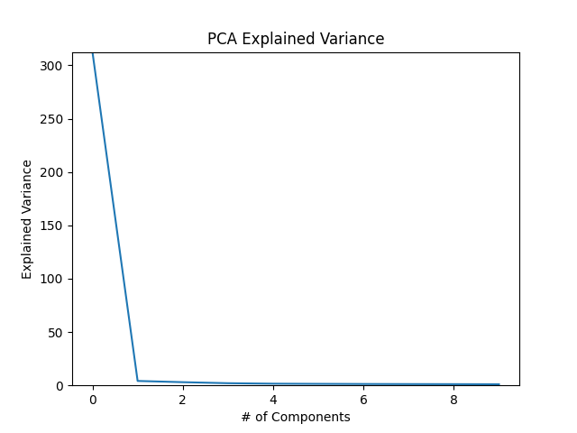

# MOAKaggle
Repository for the MOA Kaggle as a final project for COMP 379/479.


### Data

Data was downloaded from https://www.kaggle.com/c/lish-moa/data

This problem is a multi-label classification problem. The dataset contains gene expression and cell viability data
after treatment with a drug or placebo. The targets are binary Mechanism of Action (MoA) annotations. A drug can have multiple
positive annotations.

This dataset has 875 features and 206 targets. There are 23814 total samples. The dataset was split into 80% training data 
and 20% test data using sklearn's train_test_split method. Code for split is available in `splitdataset.py`.

```python
import pandas as pd
from sklearn.model_selection import train_test_split

# read 'train_features' from kaggle.
data_features = pd.read_csv('./data/lish-moa/train_features.csv', index_col=0)
# read 'train_targets_scored'
data_targets = pd.read_csv('./data/lish-moa/train_targets_scored.csv', index_col=0)

# split data into 80% train / test data
X_train, X_test, y_train, y_test = train_test_split(data_features, data_targets, random_state=1, train_size=0.8)

# output datasets to csv
X_train.to_csv('./data/train/X_train.csv')
X_test.to_csv('./data/test/X_test.csv')
y_train.to_csv('./data/train/y_train.csv')
y_test.to_csv('./data/test/y_test.csv')
```

### Preprocessing Data

All preprocessing code can be found in `preprocessing.py`.

**Encode Categorical Variables**

The dataset contains 3 categorical variables (cp_type, cp_time, and cp_does). These values were
encoded using sklearn's LabelEncoder. Data was encoded for both the training and test datasets.
The encoded data for each dataset was output to a csv file.

```python
import pandas as pd
from sklearn.preprocessing import LabelEncoder

def label_encoding(X_train, X_val, ignore=[]):
    """Function to apply sklearn's LabelEncoder to Train/Test data"""
    # copy data
    X_train_en = X_train.copy()
    X_val_en = X_val.copy()
    # define label encoder
    label_encoder = LabelEncoder()
    # get list of categorical variables
    c = (X_train.dtypes == 'object')
    # if categorical variables in dataset
    if len(c) > 0:
        # get list of categorical features
        features_to_encode = list(c[c].index)
        # ignore columns
        for i in ignore:
            features_to_encode.remove(i)
        for col in features_to_encode:
            X_train_en[col] = label_encoder.fit_transform(X_train[col])
            X_val_en[col] = label_encoder.transform(X_val[col])
    return X_train_en, X_val_en

# import data
X_train = pd.read_csv('./data/train/X_train.csv', index_col=0)
X_test = pd.read_csv('./data/test/X_test.csv', index_col=0)

# encode training and test data
X_train, X_test = label_encoding(X_train, X_test)

# Output encoded datasets to csv
X_train.to_csv('./data/train/X_train_encoded.csv')
X_test.to_csv('./data/test/X_test_encoded.csv')
```

**Dimensional Reduction**

There are 722 columns in the dataset that represent gene expression. 
The columns representing gene expression data are named g-1, g-2, ..., g-722.

There are 100 columns in the dataset that represent cell viability data for different cell types.
These columns are named c-1, c-2, ..., c-100.

PCA was done to reduce the dimensionality of this dataset. 

The `pca_processing` method was implemented to replace all the columns that begin with a given
prefix with the first n number of calculated principal components (PCs). The method also graphs the expected variance
of the first m number of PCs to help identify a good value of n. The PCA calculations were performed using sklearn's PCA method.
The `pca_processing` method is shown here:

```python
from sklearn.decomposition import PCA
import matplotlib.pyplot as plt

def pca_processing(X_train, X_val, prefix='g-', n=20, m=50):
    """
    Function to replace column data with the first n Principal Components.
    Function will output a plot of the explained variance of
    the first 50 components.
    Parameters:
        X_train: training data use to fit
        X_val: validation data to be transformed
        prefix: prefix of columns to use for pca
        n: number of principal components to use in data
        m: number of principal components to graph in elbow plot
    """
    # create copies of data
    X_train_pca = X_train.copy()
    X_test_pca = X_val.copy()

    # select gene columns
    genes = []
    for col in X_train.columns:
        if col.startswith(prefix):
            genes.append(col)

    # Drop genes from datasets
    X_train_pca = X_train_pca.drop(columns=genes)
    X_test_pca = X_test_pca.drop(columns=genes)

    # fit PCA on training data using 50 components
    pca = PCA(n_components=m)
    pca.fit(X_train[genes])

    # plot Elbow Plot for first m components
    plt.ylabel("Explained Variance")
    plt.xlabel("# of Components")
    plt.title("PCA Explained Variance")
    plt.ylim(0, max(pca.explained_variance_))
    plt.plot(pca.explained_variance_)
    plt.savefig('./plots/' +str(prefix) + 'PCA_elbow_plot.png')
    plt.close()

    def transform(data):
        """transforms the data and returns the n pcs for each sample"""
    # transform X_train genes and get first n PCs
        gene_pca = pca.transform(data)
        pcs = (data - pca.mean_).dot(pca.components_[0:n].T)
        # rename columns
        column_names = list(pcs.columns)
        for i in range(len(column_names)):
            column_names[i] = str(prefix) + "PC-" + str(column_names[i])
        pcs.columns = column_names
        return pcs

    # create final dataframes
    X_train_pca = X_train_pca.join(transform(X_train[genes]))
    X_test_pca = X_test_pca.join(transform(X_val[genes]))

    return X_train_pca, X_test_pca
```

First, the `pca_procesing` method was called on the gene expression data and the result was exported 
to csv. 

```python 
# Replace gene columns with Principal Components
X_train, X_test = pca_processing(X_train, X_test, prefix='g-', n=20, m=50)

# Export results to csv
X_train.to_csv("./data/train/X_train_gene_pca.csv")
X_test.to_csv("./data/test/X_test_gene_pca.csv")
```
The resulting plot of the explained variance at each PC for the gene expression showed a very low variance after the 20th PC.
Therefore the gene expression data was replaced with the first 20 PCs.
  


Next, the `pca_procesing` method was called on the cell viability data and the result was exported 
to csv. 

```python 
# Replace cell viability with Principal Components
X_train, X_test = pca_processing(X_train, X_test, prefix='c-', n=2, m=10)

# Export results to csv
X_train.to_csv("./data/train/X_train_gene_viability_pca.csv")
X_test.to_csv("./data/test/X_test_gene_viability_pca.csv")
```
The resulting plot of the explained variance at each PC for the gene expression showed a very low variance after the 2th PC so
the cell viability data was replaced with the first 2 PCs. 
  
